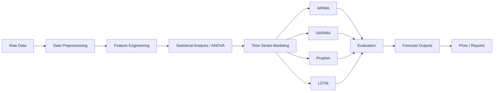

# 📈 Revenue Forecasting Pipeline


---

## 🧠 Overview

This project builds an **end-to-end revenue forecasting pipeline** using a combination of classical statistical models and modern machine learning techniques.

It addresses a real-world challenge:

> **Forecasting revenue under noisy, incomplete, and highly seasonal conditions.**

The pipeline includes:

* Data preprocessing & feature engineering
* Statistical validation (ANOVA)
* Multi-model forecasting (ARIMA, SARIMA, Prophet, LSTM)
* Model evaluation & comparison
* Forecast visualization

---

## 💼 Business Impact

* Identified strong **seasonality (~52-week cycle)** in revenue data
* Enabled **more reliable financial forecasting** through model comparison
* Provided **uncertainty-aware predictions** using statistical models
* Supports:

  * 📊 Financial planning
  * 📦 Demand forecasting
  * 📉 Risk-aware decision making

---

## 🏗️ Architecture



---

## 📁 Project Structure

```plaintext id="o0kqk9"
revenueForecast/
│
├── requirements.txt
├── README.md
├── .gitignore
│
└── revenueForecast/
    ├── main.py
    ├── config/
    ├── data/
    ├── logs/
    ├── models/
    ├── plots/
    ├── reports/
    └── src/
```

---

## 📊 Data

* Revenue and margin data aggregated at **customer level**
* Converted into a **univariate time series (Revenue vs Time)**

### Preprocessing Steps

* Data cleaning and filtering
* Aggregation by customer and time (YYYYWW)
* Handling missing periods via **time interpolation**
* Feature validation using **ANOVA testing**

---

## 🤖 Models Implemented

| Model   | Description                                      |
| ------- | ------------------------------------------------ |
| ARIMA   | Baseline statistical model                       |
| SARIMA  | Captures seasonality (**best-performing model**) |
| Prophet | Trend + seasonality modeling                     |
| LSTM    | Deep learning for temporal patterns              |

---

## 📈 Results & Model Performance

### 🔢 Evaluation Metrics

| Model   | MAE       | RMSE      | Notes            |
| ------- | --------- | --------- | ---------------- |
| SARIMA  | 557,434   | 1,330,737 | Best performance |
| Prophet | 892,580   | 1,307,344 | Smooth trend     |
| ARIMA   | 688,668   | 1,495,186 | Baseline         |
| LSTM    | 1,800,529 | 2,676,198 | Needs tuning     |

> RMSE computed as √MSE

---

### 📊 Key Insights

* SARIMA performed best due to strong seasonal structure in data
* Prophet captured smoother long-term trends but missed volatility
* LSTM underperformed due to limited tuning and data constraints
* Forecast uncertainty increases significantly over longer horizons

---

### 📉 Sample Outputs


---

## 🧠 Key Learnings

* Classical models (SARIMA) can outperform deep learning for structured time series
* Proper preprocessing significantly impacts forecasting performance
* Seasonality detection is critical for model selection
* Deep learning models require larger datasets and tuning
* Model choice should be driven by **data characteristics, not complexity**

---

## 🚀 Setup & Run

### 1. Clone repository

```bash id="ogw95f"
git clone <your-repo-url>
cd revenueForecast
```

---

### 2. Create virtual environment

```bash id="r9o8kx"
python -m venv .venv
```

---

### 3. Activate environment

**CMD:**

```bash id="ktk6vt"
.venv\Scripts\activate
```

**PowerShell:**

```powershell id="qcrb9g"
.venv\Scripts\Activate.ps1
```

---

### 4. Install dependencies

```bash id="dmb61c"
pip install -r requirements.txt
```

---

### 5. Add data

```text id="xfv9dg"
revenueForecast/data/finance_sample_data.xlsx
```

---

### 6. Run pipeline

```bash id="az0i79"
cd revenueForecast
python main.py
```

---

## ⚙️ Configuration

Edit:

```text id="km24pb"
revenueForecast/config/config.yaml
```

Example:

```yaml id="fncbrk"
data_path: data/finance_sample_data.xlsx
output_dir: reports/
model_dir: models/
```

---

## 🔧 Troubleshooting

**Module errors**

```bash id="hq3y92"
pip install -r requirements.txt
```

**Path issues**

```bash id="wyz4zk"
cd revenueForecast
python main.py
```

---

## 🔮 Future Improvements

* Hyperparameter tuning (Prophet, LSTM)
* Multivariate forecasting
* Automated model selection
* Deployment as API/dashboard

---

## 📜 License

MIT License
