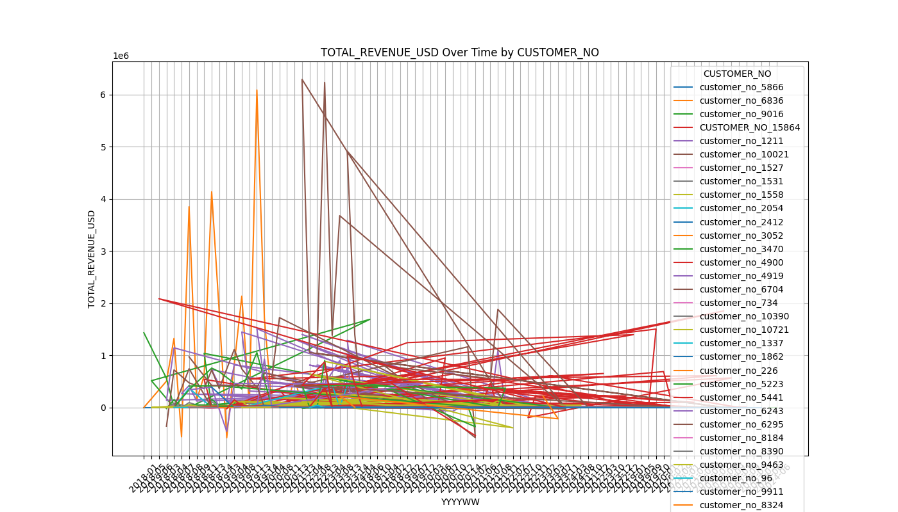
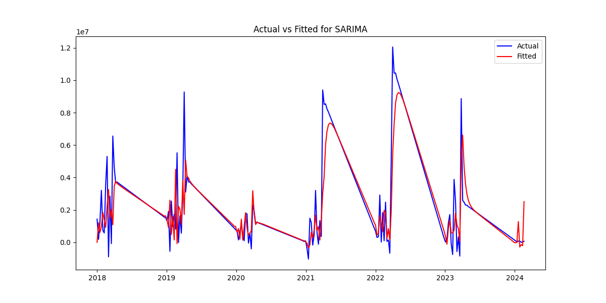
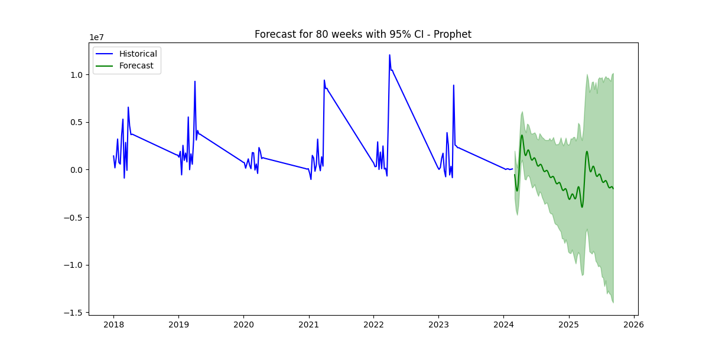
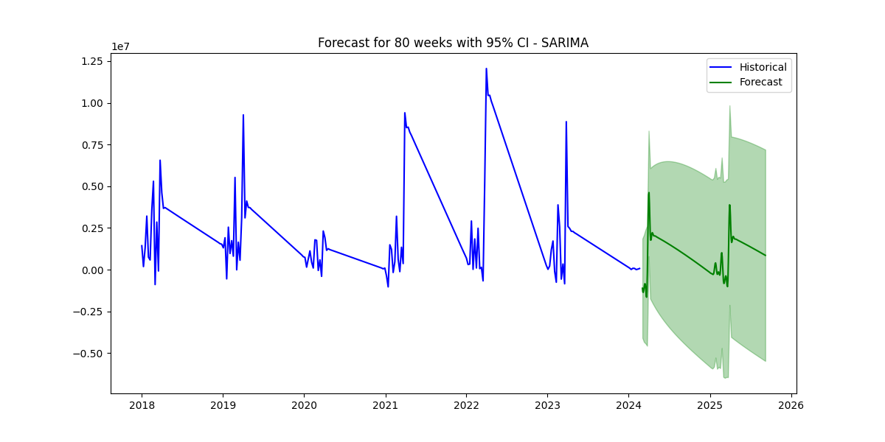
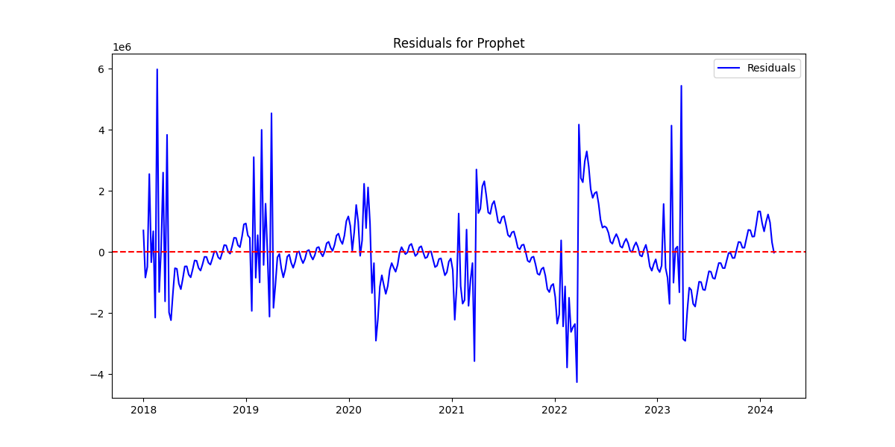

# Revenue Forecasting

## Overview
This project aims to forecast revenue using multiple time series 
models such as ARIMA, SARIMA, Prophet, and LSTM. 
The project is organized into various modules to handle data processing, 
model training, evaluation, and results visualization.

## Table of Contents
- [Overview](#overview)
- [Folder Structure](#folder-structure)
- [Data](#data)
- [Installation](#installation)
- [Usage](#usage)
- [Models](#models)
- [Results](#results)
- [Notes](#notes)
- [Contributing](#contributing)
- [License](#license)

## Folder Structure


```plaintext
project-root/
│
├── config/                 # Configuration files
│   └── config.yaml         # Configuration file with parameters and settings
│
├── data/                   # Data storage folder
│   ├── raw/                # Raw data files
│   └── processed/          # Processed data ready for modeling
│
├── logs/                   # Log files generated (Omitted for sending)
│
├── models/                 # Saved models after training (Not saved any model)
│
├── plots/                  # Generated plots for visualizing results
│
├── reports/                # Generated reports and summaries
│
├── src/                    # Source code for data processing and modeling
│          
│   ├── __init__.py         # Init file for source code
│   ├── arima_model.py      # ARIMA model implementation
│   ├── data_preprocessing.py  # Data preprocessing functions
│   ├── eda.py              # Exploratory data analysis scripts 
│   ├── evaluation.py       # Evaluation metrics and functions
│   ├── feature_analysis.py # Feature analysis scripts
│   ├── feature_engineering.py # Feature engineering functions
│   ├── forecasting.py      # Forecasting functions and utilities (not used)
│   ├── lstm_model.py       # LSTM model implementation
│   ├── prophet_model.py    # Prophet model implementation
│   └── sarima_model.py     # SARIMA model implementation
│
├── .gitignore              # Git ignore file to exclude unnecessary files
├── agg_data.csv            # Aggregated data used for modeling
├── main.py                 # Main script to run the models and evaluate results
└── requirements.txt        # Python dependencies

### 4. ** Notes on Data Used**
   - We used the revenue and total margin data. The dataset contains various columns including site names, enterprise descriptions, CBT teams, product types, customer numbers, fiscal data, and financial metrics like TOTAL_MARGIN_USD and TOTAL_REVENUE_USD. The data was subset based on filters (even though filters were redundant). We cleaned the data to aggregrate the data to customer_no, time ( in YYYYWW) and total revenue.
   - Feature ranking and ANOVA tests were done on customer_no. They seem
   to be statistiticaly significant (results in /reports/eda/anova.results.txt).We grouped the data (took Revenue Sum) based on customer No across YYYYWW. 
   - Our final data consisted of a univariate time series with Revenue as a function of time 
   - The time series had gaps ( absence of revenue reported in a certain WW or may be missing) , we did a time interpolation of the time series. 
```markdown
## Data
The `data/` directory contains the datasets used in this project:
- **raw/**: This folder stores the raw data files as received from the data source.
- **processed/**: This folder contains cleaned and preprocessed data ready for modeling. This folder contains the aggregated data with which we fitted the models. 
### Data File
- **agg_data.csv**: The aggregated dataset used for forecasting revenue. It includes time series data with total revenue (USD)
### Preprocessing
Data preprocessing includes steps such as missing value imputation, scaling, and time series decomposition. The preprocessing logic is implemented in the `data_preprocess.py` script located in the `src/` directory.
### 7. **Model Testing & Tuning**
   - We have tested tuned and implemented 4 Models. ARIMA, SARIMA, Prophet Time series ( including seasonality) and LSTM model. The ARIMA (1,0,1)
   and SARIMA (1,0,1) (1,0,1) fitted the data best and were chosen. Looking at the mean absolute errors the SARIMA models fitted the data best and the forecast (with 95% CI) ( in the reports/eda folder) was more reasonable with Prophet Model (looking at the seasonal complexity and local fluctuations in the data). It may be possible we needed to do more tuning with the Prophet model hyperparameters or maybe need to add a daily component to check the predicted values for a better MSE. The SARIMA model may also be tuned through domain knowledge getting to know the seasonality component better ( for thie project we took m = 52) 
```markdown
## Models
### ARIMA
The ARIMA model is used for univariate time series forecasting. It is implemented in the `src/arima_model.py` script.
### SARIMA
The SARIMA model extends ARIMA to account for seasonality. It is implemented in the `src/sarima_model.py` script.
### Prophet
The Prophet model is a powerful tool for time series forecasting, especially with daily data ( we have not added that part in this model). It is implemented in the `src/prophet_model.py` script.
### LSTM
The LSTM model is a type of recurrent neural network used for time series forecasting. It is particularly useful for capturing long-term dependencies in the data. It is implemented in the `src/lstm_model.py` script. The model is trained with 90 epochs and a batch size of 16 by default.
## Results
The data for actual vs predicted by the metrics we used (MSE) matches pretty well for the SARIMA 
(1,0,1)(1,0,1) where we used a 52 week seasonal period and the orders imply that the data fits using seasonal period with a lag of one step and one moving average. The data however was deemed stationary as no differencing was generated. 
We included the forecast plots from two models here SARIMA and Prophet. The SARIMA forecast captures some volatility in the data but shows significant uncertainty with a wide confidence interval, especially toward the end of the forecast period. The Prophet forecast, on the other hand, displays a clearer downward trend with a smoother confidence interval, though it smooths out some of the historical volatility. Overall, SARIMA might be more suited for capturing cyclical patterns, while Prophet appears better at modeling long-term trends with less concern for short-term fluctuations.
The results of the model training and evaluation, including plots and summaries, are stored in the `results/` and `plots/` directories.
### Revenue by Customer Plot

### Actual vs Predicted Plot

### Forecast Plot for 80 Weeks from Prophet Model

### Forecast Plot for 80 Weeks from SARIMA Model

### Residual Plot

### Model Evaluation
The models are evaluated based on metrics such as RMSE, MAE, and MAPE. The evaluation results are logged in the `reports/` directory.
## Notes
- Ensure that all paths in the configuration file `config/config.yaml` are correct before running the scripts.
- Logs are generated for each run and stored in the `logs/` directory for debugging purposes. ( we have omitted the logs for this exercise in the .gitignore file)
- The project is modular and can be easily extended with additional models 
or data sources.

## Project Structure & Instructions /

revenueForecast/
│
├── requirements.txt
├── README.md
├── .gitignore
│
└── revenueForecast/
    ├── main.py
    ├── config/
    │   ├── config.yaml
    │   ├── logging.conf
    ├── data/
    ├── logs/
    ├── models/
    ├── plots/
    ├── reports/
    └── src/


##Instructions: 

(Please do it in VSCode or any IDE of your choice) 


1. Clone the repository
git clone <your-repo-url>
cd revenueForecast
2. Create a virtual environment (Python 3.11+)
python -m venv .venv
3. Activate the environment
Windows (Command Prompt)
.venv\Scripts\activate
Windows (PowerShell)
.venv\Scripts\Activate.ps1

If blocked:

Set-ExecutionPolicy -Scope Process -ExecutionPolicy Bypass
4. Install dependencies
python -m pip install --upgrade pip
python -m pip install -r requirements.txt
5. Data setup

Place your input file here:

revenueForecast/data/finance_sample_data.xlsx

If not included in repo, manually copy it into the data/ folder.
